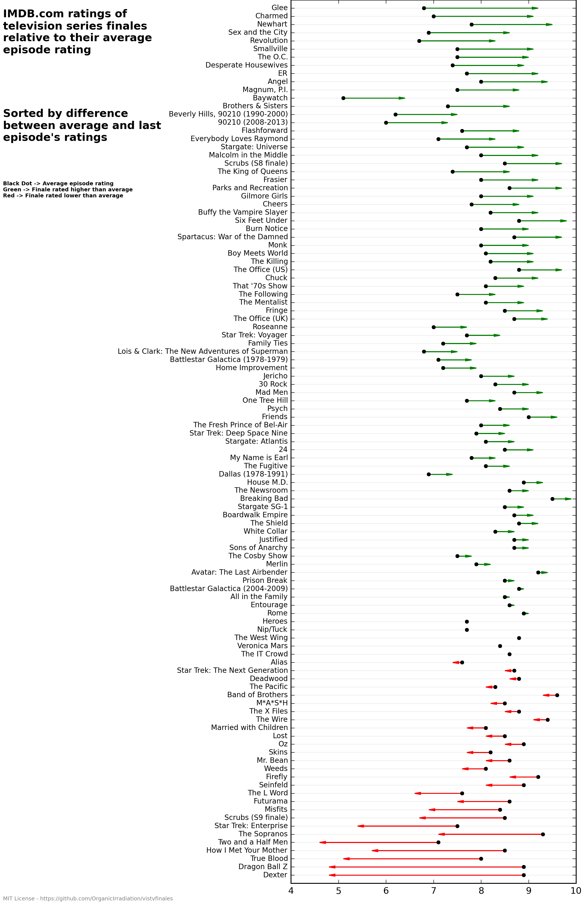
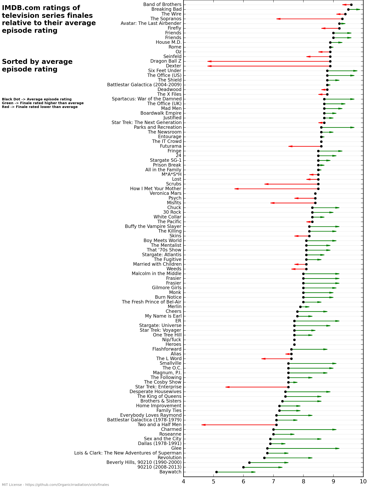
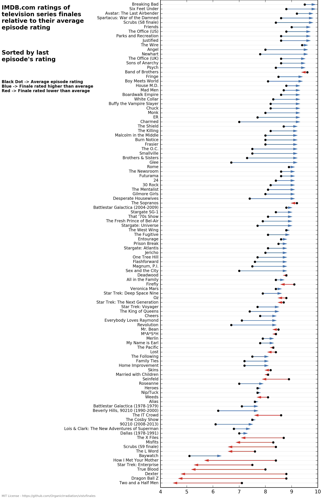
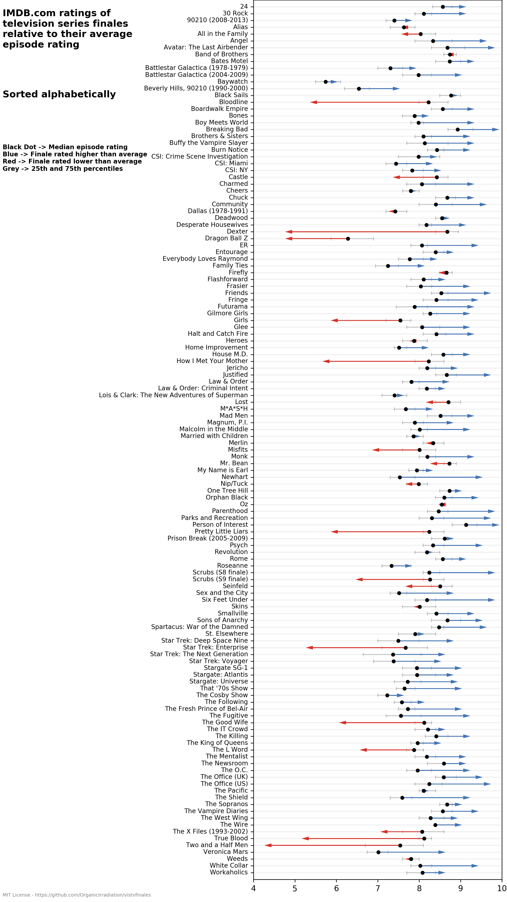

# vistvfinales

iPython notebook to visually compare the average performance of a television series to its finale episode, identifying shows that surprise and disappoint.

Clone (preferably into a virtualenv):

    $ git clone https://github.com/OrganicIrradiation/vistvfinales.git
    $ cd vistvfinales

Install dependencies:

    $ pip install -r requirements.txt

Load notebook:

    $ ipython notebook vistvfinales.ipynb

Run!

Here are the plots it generates:

